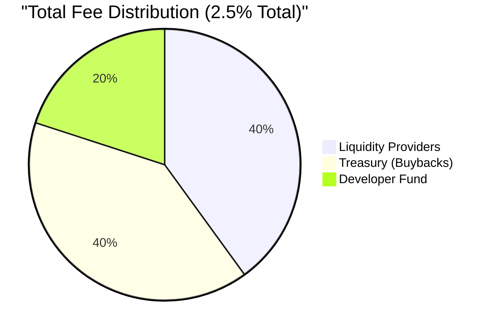

## The Sustainable Fee Model

Prediqt's developer fee model is designed to create a self-sustaining ecosystem that benefits all participants while funding continuous platform improvements.

<Callout type="info" emoji="🔄">
  Every fee collected contributes to the flywheel effect, creating value for token holders and improving the platform for all users.
</Callout>

## Fee Structure Overview

<Table>
  <TableHeader>
    <TableRow>
      <TableHead>Fee Type</TableHead>
      <TableHead>Rate</TableHead>
      <TableHead>Purpose</TableHead>
      <TableHead>Distribution</TableHead>
    </TableRow>
  </TableHeader>
  <TableBody>
    <TableRow>
      <TableCell>**Trading Fee**</TableCell>
      <TableCell>2% (less with $PREDIQT)</TableCell>
      <TableCell>Market liquidity & operations</TableCell>
      <TableCell>50% LP, 50% Treasury</TableCell>
    </TableRow>
    <TableRow>
      <TableCell>**Developer Fee**</TableCell>
      <TableCell>0.5%</TableCell>
      <TableCell>Platform development & buybacks</TableCell>
      <TableCell>100% Treasury</TableCell>
    </TableRow>
    <TableRow>
      <TableCell>**Early Exit Fee**</TableCell>
      <TableCell>1%</TableCell>
      <TableCell>Discourage manipulation</TableCell>
      <TableCell>100% Market LP</TableCell>
    </TableRow>
    <TableRow>
      <TableCell>**Market Creation**</TableCell>
      <TableCell>10 $PREDIQT</TableCell>
      <TableCell>Spam prevention</TableCell>
      <TableCell>Burned</TableCell>
    </TableRow>
  </TableBody>
</Table>

## How Developer Fees Work

<Steps>
  <Step title="Fee Collection" icon="1">
    0.5% developer fee automatically collected on every trade
  </Step>
  <Step title="Treasury Accumulation" icon="2">
    Fees accumulate in the protocol treasury smart contract
  </Step>
  <Step title="Buyback Trigger" icon="3">
    When treasury reaches threshold, buyback mechanism activates
  </Step>
  <Step title="Market Purchase" icon="4">
    Treasury buys $PREDIQT from DEX at market price
  </Step>
  <Step title="Distribution" icon="5">
    Purchased tokens distributed to stakers or burned
  </Step>
</Steps>

## Fee Allocation Breakdown



### Detailed Allocation

<Tabs>
  <Tab title="Liquidity Providers (40%)">
    - Ensures deep liquidity for all markets
    - Rewards users who provide capital
    - Reduces slippage on large trades
    - Creates sustainable yield opportunities
  </Tab>
  <Tab title="Treasury/Buybacks (40%)">
    - Funds automatic $PREDIQT purchases
    - Creates constant buy pressure
    - Increases token value over time
    - Benefits all token holders
  </Tab>
  <Tab title="Developer Fund (20%)">
    - Funds ongoing development
    - Pays for infrastructure costs
    - Security audits and improvements
    - Marketing and partnerships
  </Tab>
</Tabs>

## The Flywheel Effect

<Note>
  The developer fee model creates a self-reinforcing cycle that grows stronger with increased platform usage.
</Note>

### How It Works

<CardGroup cols={2}>
  <Card title="More Users" icon="users" color="#299EFF">
    Increased betting activity generates more fees
  </Card>
  <Card title="More Fees" icon="coins" color="#299EFF">
    Higher fee revenue increases buyback volume
  </Card>
  <Card title="Token Appreciation" icon="chart-line-up" color="#299EFF">
    Buybacks create upward price pressure
  </Card>
  <Card title="Better Incentives" icon="gift" color="#299EFF">
    Higher token value attracts more users
  </Card>
</CardGroup>

## Fee Optimization Strategies

### For Regular Users

<AccordionGroup>
  <Accordion title="Use $PREDIQT for Lower Fees" icon="percent">
    Save up to 30% on trading fees by using $PREDIQT and reaching higher tiers
  </Accordion>
  <Accordion title="Provide Liquidity" icon="water">
    Earn a share of trading fees by providing liquidity to popular markets
  </Accordion>
  <Accordion title="Stake for Rebates" icon="piggy-bank">
    Higher staking tiers receive quarterly fee rebates
  </Accordion>
</AccordionGroup>

### For Market Makers

<AccordionGroup>
  <Accordion title="Volume Discounts" icon="layer-group">
    Traders with >$100k monthly volume receive additional fee reductions
  </Accordion>
  <Accordion title="Maker Rebates" icon="arrow-right-arrow-left">
    Limit orders that add liquidity receive 0.1% rebates
  </Accordion>
  <Accordion title="LP Rewards" icon="trophy">
    Top liquidity providers earn bonus $PREDIQT rewards monthly
  </Accordion>
</AccordionGroup>

## Treasury Management

### Current Treasury Stats
<Info>
  Treasury holdings and buyback history are fully transparent and viewable on-chain at our [Treasury Dashboard](https://prediqtmarket.com/treasury).
</Info>

### Buyback Mechanics

<CodeGroup>
```solidity Smart Contract Logic
// Simplified buyback function
function executeBuyback() external {
    require(treasuryBalance >= BUYBACK_THRESHOLD, "Threshold not met");
    
    uint256 buybackAmount = treasuryBalance * BUYBACK_PERCENTAGE / 100;
    
    // Buy $PREDIQT from DEX
    uint256 tokensBought = swapSOLForPREDIQT(buybackAmount);
    
    // Distribute: 50% to stakers, 50% burned
    distributeToStakers(tokensBought / 2);
    burnTokens(tokensBought / 2);
    
    emit BuybackExecuted(buybackAmount, tokensBought);
}
```

```typescript Buyback Schedule
const BUYBACK_PARAMS = {
  threshold: 10000, // 10,000 SOL
  percentage: 80,   // Use 80% for buyback
  frequency: "WEEKLY",
  minPrice: 0,     // No minimum price
  maxSlippage: 3    // 3% max slippage
};
```
</CodeGroup>

## Fee Sustainability Model

### Revenue Projections

| Daily Volume | Daily Fees (0.5%) | Annual Revenue | Annual Buybacks |
|--------------|-------------------|----------------|-----------------|
| $1M | $5,000 | $1.825M | $1.46M |
| $5M | $25,000 | $9.125M | $7.3M |
| $10M | $50,000 | $18.25M | $14.6M |
| $50M | $250,000 | $91.25M | $73M |

### Long-term Vision

<Warning>
  As the platform grows, fee percentages may be reduced while maintaining absolute revenue growth through increased volume.
</Warning>

## Competitive Advantage

<Tabs>
  <Tab title="vs Traditional Betting">
    **Traditional platforms:** 5-10% margins
    **Prediqt:** 2.5% total fees
    
    - 75% lower fees
    - Transparent fee structure
    - Fees benefit users via buybacks
  </Tab>
  <Tab title="vs Other DeFi">
    **Typical DEX:** 0.3% swap fee only
    **Prediqt:** 0.5% goes to ecosystem growth
    
    - Creates token value accrual
    - Sustainable development funding
    - Aligned stakeholder incentives
  </Tab>
</Tabs>

## Developer Fund Uses

<CardGroup cols={2}>
  <Card title="Infrastructure" icon="server">
    High-performance RPC nodes, data storage, and API services
  </Card>
  <Card title="Security" icon="shield">
    Regular audits, bug bounties, and security monitoring
  </Card>
  <Card title="Innovation" icon="lightbulb">
    New features, mobile apps, and cross-chain bridges
  </Card>
  <Card title="Growth" icon="rocket">
    Marketing, partnerships, and user acquisition
  </Card>
</CardGroup>

## Transparency & Governance

All fee parameters can be adjusted through governance:

- Fee percentages
- Buyback thresholds
- Distribution ratios
- Treasury management

<Note>
  $PREDIQT holders vote on all major fee structure changes, ensuring the model evolves with community needs.
</Note>

## Next Steps

<CardGroup cols={3}>
  <Card
    title="Flywheel Deep Dive"
    icon="arrows-spin"
    href="/ecosystem/flywheel-explained"
  >
    Understand the full flywheel
  </Card>
  <Card
    title="View Treasury"
    icon="vault"
    href="https://prediqtmarket.com/treasury"
  >
    Live treasury statistics
  </Card>
  <Card
    title="Fee Calculator"
    icon="calculator"
    href="https://prediqtmarket.com/fees"
  >
    Calculate your trading costs
  </Card>
</CardGroup> 