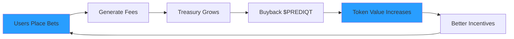

## The Prediqt Flywheel

The Prediqt flywheel is a carefully designed economic mechanism that creates a positive feedback loop, where platform growth directly benefits token holders and attracts more users.

<Callout type="success" emoji="🔄">
  Unlike traditional platforms where value flows to shareholders, Prediqt's flywheel ensures value accrues to users and token holders through automated buybacks and burns.
</Callout>

## How the Flywheel Works



## The Five Stages

<Steps>
  <Step title="Platform Activity" icon="1">
    ### Users Drive Volume
    
    Every bet placed on Prediqtmarket generates fees:
    - Trading fees (2%)
    - Developer fees (0.5%)
    - Early exit fees (1%)
    
    More users = More bets = More fees
  </Step>
  
  <Step title="Fee Accumulation" icon="2">
    ### Treasury Builds Value
    
    Fees flow into the protocol treasury:
    - Automated collection via smart contracts
    - Transparent on-chain accounting
    - No manual intervention needed
    
    Current treasury: View on [Treasury Dashboard](https://prediqt.market/treasury)
  </Step>
  
  <Step title="Automated Buybacks" icon="3">
    ### Market Purchases Begin
    
    When treasury hits thresholds:
    - Smart contract triggers buyback
    - Purchases $PREDIQT from DEX
    - Creates consistent buy pressure
    - No human decision-making
  </Step>
  
  <Step title="Value Distribution" icon="4">
    ### Token Holders Benefit
    
    Bought tokens are:
    - 50% distributed to stakers
    - 50% permanently burned
    - Reduces circulating supply
    - Increases scarcity
  </Step>
  
  <Step title="Enhanced Attraction" icon="5">
    ### Growth Accelerates
    
    Rising token value creates:
    - Better staking rewards
    - Increased fee savings
    - More users joining
    - Higher platform volume
    
    **The cycle repeats, stronger each time**
  </Step>
</Steps>

## Flywheel Metrics

### Key Performance Indicators

<CardGroup cols={2}>
  <Card title="Daily Volume" icon="chart-line">
    Betting volume directly correlates with flywheel strength
  </Card>
  <Card title="Buyback Rate" icon="shopping-cart">
    Frequency and size of automated token purchases
  </Card>
  <Card title="Burn Rate" icon="fire">
    Tokens permanently removed from circulation
  </Card>
  <Card title="Staker APY" icon="percentage">
    Returns for long-term token holders
  </Card>
</CardGroup>

## Mathematical Model

<Tabs>
  <Tab title="Simple Example">
    **Assumptions:**
    - Daily volume: $1M
    - Developer fee: 0.5%
    - Daily fees: $5,000
    - Weekly buyback: $35,000
    
    **Results:**
    - Annual buybacks: $1.82M
    - If token price 2x: Same $ buys 50% fewer tokens
    - Creates natural price support
  </Tab>
  <Tab title="Growth Scenario">
    **Year 1:** $1M daily volume
    - Annual buyback: $1.82M
    - Supply reduction: 2%
    
    **Year 2:** $5M daily volume (5x growth)
    - Annual buyback: $9.1M
    - Supply reduction: 8%
    
    **Year 3:** $20M daily volume
    - Annual buyback: $36.5M
    - Supply reduction: 25%+
  </Tab>
</Tabs>

## Comparing Flywheel Models

### Prediqt vs Other Protocols

<ComparisonTable>
  <ComparisonHeader>
    <ComparisonTitle>Traditional Platform</ComparisonTitle>
    <ComparisonTitle>Prediqt Flywheel</ComparisonTitle>
  </ComparisonHeader>
  <ComparisonRow>
    <ComparisonCell>Profits go to company shareholders</ComparisonCell>
    <ComparisonCell>Profits go to token holders via buybacks</ComparisonCell>
  </ComparisonRow>
  <ComparisonRow>
    <ComparisonCell>Users pay fees with no return</ComparisonCell>
    <ComparisonCell>Users own tokens that appreciate</ComparisonCell>
  </ComparisonRow>
  <ComparisonRow>
    <ComparisonCell>Value extraction model</ComparisonCell>
    <ComparisonCell>Value distribution model</ComparisonCell>
  </ComparisonRow>
  <ComparisonRow>
    <ComparisonCell>Misaligned incentives</ComparisonCell>
    <ComparisonCell>All participants benefit from growth</ComparisonCell>
  </ComparisonRow>
</ComparisonTable>

## Flywheel Accelerators

### What Makes It Spin Faster

<AccordionGroup>
  <Accordion title="Increased Betting Volume" icon="chart-line-up">
    More users discovering and using the platform drives higher fee generation
  </Accordion>
  <Accordion title="Major Events" icon="calendar">
    Elections, championships, and trending topics create volume spikes
  </Accordion>
  <Accordion title="Token Utility Expansion" icon="plus">
    New use cases for $PREDIQT increase demand independent of buybacks
  </Accordion>
  <Accordion title="Cross-Chain Integration" icon="link">
    Expanding beyond Solana multiplies potential user base
  </Accordion>
  <Accordion title="Partnership Integrations" icon="handshake">
    Other platforms using Prediqt markets amplifies volume
  </Accordion>
</AccordionGroup>

## Real-World Impact

### Scenario Analysis

<CodeGroup>
```python Volume Growth Model
# Flywheel impact on token value
def calculate_flywheel_impact(daily_volume, years):
    annual_fees = daily_volume * 365 * 0.005
    buyback_amount = annual_fees * 0.8
    
    results = []
    for year in range(1, years + 1):
        # Assume 50% volume growth per year
        volume = daily_volume * (1.5 ** (year - 1))
        fees = volume * 365 * 0.005
        buyback = fees * 0.8
        
        results.append({
            'year': year,
            'daily_volume': f"${volume/1e6:.1f}M",
            'annual_buyback': f"${buyback/1e6:.1f}M"
        })
    
    return results

# Starting at $1M daily volume
print(calculate_flywheel_impact(1_000_000, 5))
```

```javascript Token Supply Impact
// Calculate supply reduction over time
function supplyImpact(initialSupply, annualBurnRate) {
  const years = 5;
  let supply = initialSupply;
  const results = [];
  
  for (let year = 1; year <= years; year++) {
    const burned = supply * (annualBurnRate / 100);
    supply -= burned;
    
    results.push({
      year,
      circulating: supply.toLocaleString(),
      burned: burned.toLocaleString(),
      reduction: ((1 - supply/initialSupply) * 100).toFixed(1) + '%'
    });
  }
  
  return results;
}

// 1B initial supply, 5% annual burn
console.log(supplyImpact(1_000_000_000, 5));
```
</CodeGroup>

## Sustainability Features

### Built for Long-Term Growth

<CardGroup cols={2}>
  <Card title="No Inflation" icon="ban">
    Fixed supply ensures buybacks always reduce circulation
  </Card>
  <Card title="Protocol Owned" icon="building">
    Treasury controlled by smart contracts, not individuals
  </Card>
  <Card title="Transparent Rules" icon="scroll">
    All parameters visible on-chain and governance-controlled
  </Card>
  <Card title="Aligned Incentives" icon="hands">
    Everyone benefits from platform growth
  </Card>
</CardGroup>

## Flywheel Governance

Token holders can vote on:

- Buyback frequency and thresholds
- Distribution ratios (stakers vs burns)
- Treasury management strategies
- Fee structure modifications

<Note>
  The flywheel parameters can evolve through governance, but the core mechanism of value flowing to token holders remains unchangeable.
</Note>

## Future Enhancements

### Planned Flywheel Upgrades

<Steps>
  <Step title="Dynamic Buybacks">
    AI-optimized buyback timing for maximum impact
  </Step>
  <Step title="Multi-Asset Treasury">
    Diversified holdings for stability
  </Step>
  <Step title="Yield Strategies">
    Treasury earns additional yield between buybacks
  </Step>
  <Step title="Cross-Chain Buybacks">
    Aggregate liquidity from multiple chains
  </Step>
</Steps>

## Why This Matters

<Callout type="info" emoji="💡">
  The flywheel creates a unique alignment where:
  - Users want to bet more (better experience)
  - Token holders want more users (value accrual)
  - Developers want platform growth (sustainability)
  
  Everyone wins when Prediqt grows.
</Callout>

## Track the Flywheel

<CardGroup cols={3}>
  <Card
    title="Live Metrics"
    icon="gauge"
    href="https://prediqt.market/flywheel"
  >
    Real-time flywheel statistics
  </Card>
  <Card
    title="Treasury Status"
    icon="vault"
    href="https://prediqt.market/treasury"
  >
    Current holdings & history
  </Card>
  <Card
    title="Token Analytics"
    icon="chart-pie"
    href="https://prediqt.market/analytics"
  >
    Supply and price metrics
  </Card>
</CardGroup>

## Join the Flywheel

<Steps>
  <Step title="Buy $PREDIQT">
    Acquire tokens to participate in value accrual
  </Step>
  <Step title="Stake Tokens">
    Lock tokens to earn flywheel distributions
  </Step>
  <Step title="Use Platform">
    Every bet strengthens the flywheel
  </Step>
  <Step title="Share Prediqt">
    More users = Stronger flywheel = Higher value
  </Step>
</Steps>

<Callout type="success" emoji="🚀">
  The flywheel is already spinning. The earlier you join, the more you benefit from its acceleration.
</Callout> 