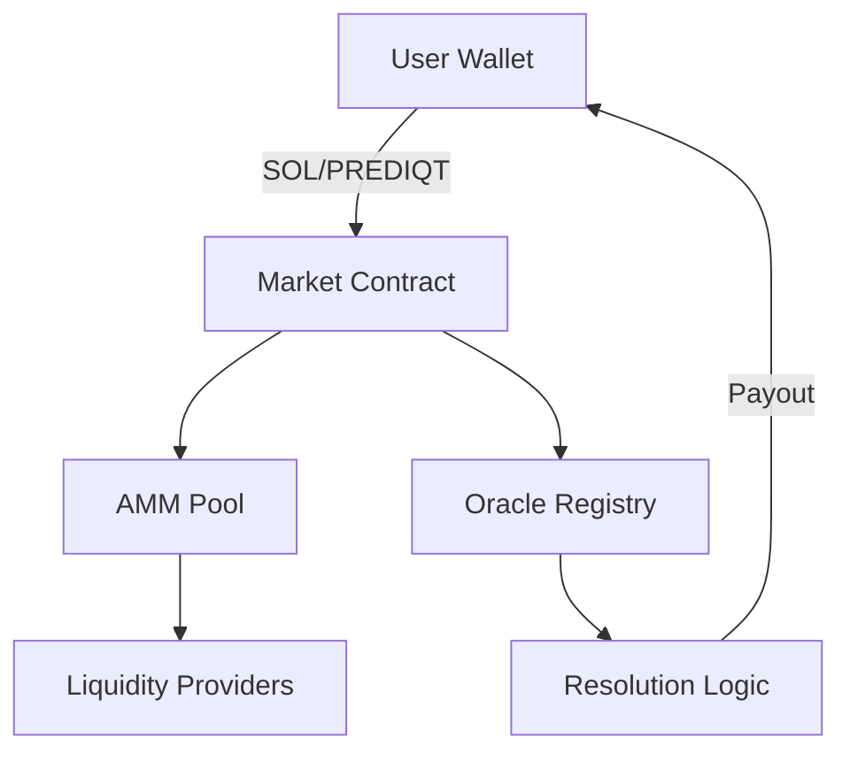

## The Prediction Market Model

Prediqt operates on a simple yet powerful principle: **collective intelligence**. By allowing users to bet on outcomes, the market aggregates information and produces probability estimates that often outperform expert predictions.

<Note>
  Prediction markets have historically shown 70-90% accuracy in forecasting real-world events, making them one of the most reliable forecasting tools available.
</Note>

## How Markets Work

<Steps>
  <Step title="Market Creation">
    Markets are created for specific events with clear, verifiable outcomes. Each market has:
    - A clear question (e.g., "Will candidate X win the election?")
    - Defined resolution criteria
    - Expiration date
    - Oracle source for resolution
  </Step>
  <Step title="Trading Phase">
    Users buy shares representing different outcomes:
    - YES shares: Betting the event will happen
    - NO shares: Betting the event won't happen
    - Share prices reflect market probability (e.g., $0.70 = 70% chance)
  </Step>
  <Step title="Resolution">
    When the event concludes:
    - Oracles verify the outcome
    - Winning shares pay out $1.00
    - Losing shares become worthless
  </Step>
</Steps>

## The AMM Model

Prediqt uses an **Automated Market Maker (AMM)** to ensure liquidity:

<CodeGroup>
```solidity Contract Logic
// Simplified AMM pricing function
function calculatePrice(uint256 yesShares, uint256 noShares) {
    uint256 k = yesShares * noShares; // Constant product
    return yesShares / (yesShares + noShares);
}
```

```typescript Example Trade
// User wants to buy 100 YES shares
const currentPrice = 0.65; // 65% probability
const slippage = calculateSlippage(100, liquidity);
const totalCost = 100 * (currentPrice + slippage);
```
</CodeGroup>

## Key Features

<Tabs>
  <Tab title="Binary Markets">
    Most Prediqt markets are binary (YES/NO), making them simple to understand and trade. The sum of YES and NO probabilities always equals 100%.
  </Tab>
  <Tab title="Continuous Trading">
    Unlike traditional betting, you can buy and sell shares anytime before resolution, allowing you to:
    - Take profits early
    - Cut losses
    - React to new information
  </Tab>
  <Tab title="Liquidity Pools">
    Each market has its own liquidity pool, ensuring:
    - Always available counterparty
    - Transparent pricing
    - No order matching needed
  </Tab>
</Tabs>

## Oracle Integration

<Warning>
  Accurate market resolution depends on reliable oracles. Prediqt integrates with multiple oracle providers to ensure tamper-proof results.
</Warning>

### Oracle Sources

<CardGroup cols={2}>
  <Card title="Pyth Network" icon="link">
    For crypto price feeds and DeFi metrics
  </Card>
  <Card title="Chainlink" icon="chain">
    For sports results and weather data
  </Card>
  <Card title="Custom Oracles" icon="code">
    For political events and unique outcomes
  </Card>
  <Card title="Multi-sig Verification" icon="shield-check">
    Critical events require multiple oracle confirmations
  </Card>
</CardGroup>

## Fee Structure

Prediqt operates with minimal fees to maximize user returns:

| Fee Type | Amount | Distribution |
|----------|--------|--------------|
| Trading Fee | 2% | 50% to liquidity providers, 50% to treasury |
| Early Exit Fee | 1% | Reduces speculation, goes to liquidity pool |
| Developer Fee | 0.5% | Funds ongoing development and buybacks |

## Smart Contract Architecture



## Next Steps

<CardGroup cols={2}>
  <Card
    title="Start Trading"
    icon="play"
    href="/using/getting-started"
  >
    Learn how to place your first bet
  </Card>
  <Card
    title="Understand Tokenomics"
    icon="chart-line"
    href="/token/about-prediqt"
  >
    Explore the $PREDIQT token utility
  </Card>
</CardGroup> 