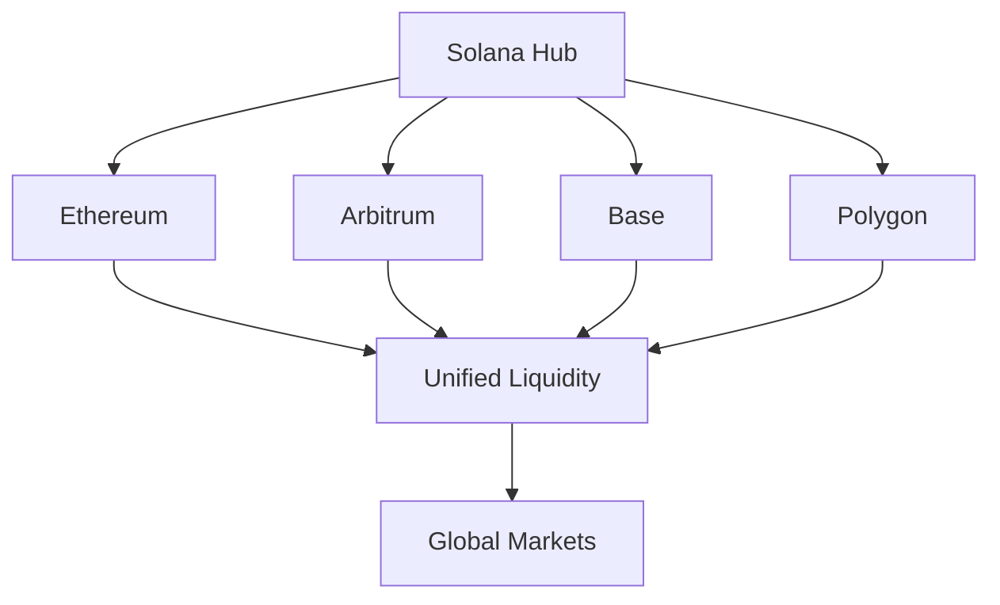

## Phase 3 Vision

Phase 3 transforms Prediqt into an open, permissionless ecosystem where anyone can create markets, integrate predictions into their applications, and participate in the global information economy.

<Callout type="success" emoji="🌍">
  Our ultimate goal: Become the decentralized information layer that powers decision-making across Web3 and beyond.
</Callout>

## Timeline: 2025 and Beyond

<Steps>
  <Step title="Q1 2025" icon="calendar">
    ### Community Market Creation
    - Permissionless market deployment
    - Custom oracle integration
    - Market creator rewards
    - Curation mechanisms
  </Step>
  
  <Step title="Q2 2025" icon="calendar">
    ### Cross-Chain Expansion
    - Ethereum integration via Wormhole
    - Arbitrum deployment
    - Base network launch
    - Unified liquidity pools
  </Step>
  
  <Step title="Q3 2025" icon="calendar">
    ### Institutional Features
    - White-label solutions
    - Compliance tools
    - Institutional API
    - Custom market creation
  </Step>
  
  <Step title="Q4 2025" icon="calendar">
    ### AI & Automation
    - AI-powered market creation
    - Automated resolution
    - Predictive analytics
    - Smart routing
  </Step>
  
  <Step title="2026+" icon="calendar">
    ### Global Adoption
    - Real-world oracle network
    - Government partnerships
    - Traditional finance bridges
    - Mass market adoption
  </Step>
</Steps>

## Open Market Creation

### Permissionless Innovation

<CardGroup cols={2}>
  <Card title="Create Any Market" icon="plus-circle" color="#299EFF">
    Deploy markets on any verifiable event with custom parameters
  </Card>
  <Card title="Choose Your Oracle" icon="link" color="#299EFF">
    Select from approved oracles or propose new data sources
  </Card>
  <Card title="Set Your Fees" icon="percent" color="#299EFF">
    Market creators earn 0.5% of volume as incentive
  </Card>
  <Card title="Community Curation" icon="star" color="#299EFF">
    Quality markets get promoted through community voting
  </Card>
</CardGroup>

### Market Creation Process

<Tabs>
  <Tab title="Simple Markets">
    **One-Click Creation**
    1. Choose from templates
    2. Set resolution date
    3. Select oracle
    4. Deploy with 100 $PREDIQT
    
    **Examples:**
    - Sports game outcomes
    - Price predictions
    - Yes/No events
  </Tab>
  <Tab title="Complex Markets">
    **Custom Parameters**
    1. Define resolution logic
    2. Set multiple outcomes
    3. Create oracle specs
    4. Community review
    5. Deploy with 1000 $PREDIQT
    
    **Examples:**
    - Multi-outcome elections
    - Conditional markets
    - Index predictions
  </Tab>
</Tabs>

## Cross-Chain Architecture

### Multi-Chain Vision



### Technical Implementation

<AccordionGroup>
  <Accordion title="Wormhole Integration" icon="bridge">
    Cross-chain message passing for unified market state across all chains
  </Accordion>
  <Accordion title="Liquidity Aggregation" icon="water">
    Single liquidity pool accessible from any supported chain
  </Accordion>
  <Accordion title="Universal Accounts" icon="user">
    One account, all chains - seamless user experience
  </Accordion>
  <Accordion title="Chain Abstraction" icon="eye-slash">
    Users don't need to know which chain they're on
  </Accordion>
</AccordionGroup>

## Institutional Adoption

### Enterprise Solutions

<CardGroup cols={2}>
  <Card title="White-Label Platform" icon="palette">
    Fully customizable prediction markets for your brand
  </Card>
  <Card title="Compliance Suite" icon="shield-check">
    KYC/AML integration and regulatory reporting tools
  </Card>
  <Card title="Private Markets" icon="lock">
    Create internal prediction markets for decision-making
  </Card>
  <Card title="API Infrastructure" icon="code">
    Enterprise-grade APIs with SLAs and dedicated support
  </Card>
</CardGroup>

### Use Cases

<Tabs>
  <Tab title="Financial Institutions">
    - Risk assessment markets
    - Economic indicator predictions
    - Portfolio hedge instruments
    - Client sentiment tools
  </Tab>
  <Tab title="Corporations">
    - Product launch predictions
    - Internal forecasting
    - Strategic planning
    - Employee incentives
  </Tab>
  <Tab title="Media Companies">
    - Audience engagement
    - Content predictions
    - Real-time polling
    - Interactive journalism
  </Tab>
  <Tab title="Governments">
    - Policy impact assessment
    - Citizen sentiment
    - Budget forecasting
    - Public decision-making
  </Tab>
</Tabs>

## AI Integration

### Intelligent Markets

<Steps>
  <Step title="AI Market Creation">
    Natural language to market deployment - describe your market in plain English
  </Step>
  <Step title="Smart Resolution">
    AI verifies outcomes from multiple sources for accurate resolution
  </Step>
  <Step title="Predictive Analytics">
    Machine learning models provide market insights and trends
  </Step>
  <Step title="Automated Trading">
    AI agents participate in markets to improve liquidity and efficiency
  </Step>
</Steps>

### AI Features

<CodeGroup>
```python AI Market Creator
from prediqt_ai import MarketCreator

# Create market from description
creator = MarketCreator()
market = creator.from_text(
    "Will SpaceX successfully land humans on Mars by 2030?",
    oracle_hints=["NASA", "SpaceX official"],
    auto_deploy=True
)

print(f"Market deployed: {market.address}")
print(f"Suggested liquidity: {market.suggested_liquidity}")
```

```typescript Predictive Analytics
import { PrediqtAI } from '@prediqt/ai';

const ai = new PrediqtAI();

// Get AI predictions
const analysis = await ai.analyzeMarket('bitcoin-100k-2025');

console.log(`AI Prediction: ${analysis.probability}%`);
console.log(`Confidence: ${analysis.confidence}`);
console.log(`Key Factors: ${analysis.factors}`);
```
</CodeGroup>

## Ecosystem Partnerships

### Strategic Integrations

<CardGroup cols={2}>
  <Card title="DeFi Protocols" icon="coins">
    Use predictions as collateral, yield strategies, and risk management
  </Card>
  <Card title="Gaming Platforms" icon="gamepad">
    Integrate prediction markets into games and metaverses
  </Card>
  <Card title="Social Networks" icon="share-nodes">
    Native prediction features in social media platforms
  </Card>
  <Card title="Data Providers" icon="database">
    Premium data feeds and analytics partnerships
  </Card>
</CardGroup>

## Token Evolution

### $PREDIQT in Phase 3

| Utility | Description | Impact |
|---------|-------------|--------|
| **Market Creation** | Stake to create markets | Demand driver |
| **Oracle Staking** | Stake to become oracle | Security layer |
| **Governance Power** | Control protocol evolution | Decentralization |
| **Fee Sharing** | Earn from ecosystem growth | Value accrual |
| **Cross-Chain Gas** | Universal gas token | Utility expansion |

## Success Metrics

### Long-Term Targets

| Metric | 2025 Target | 2030 Vision |
|--------|-------------|-------------|
| **Total Users** | 1M+ | 100M+ |
| **Daily Volume** | $100M | $10B |
| **Active Markets** | 10,000 | 1M+ |
| **Chains Supported** | 5 | 20+ |
| **TVL** | $1B | $100B |
| **Market Creators** | 1,000 | 100,000 |

## The Prediqt Standard

### Becoming the Industry Standard

<Note>
  Our goal is for "Prediqt odds" to become as trusted and widely used as traditional polling or expert predictions.
</Note>

### Integration Examples

- **News**: "According to Prediqt markets, there's a 73% chance..."
- **Finance**: "Prediqt futures indicate Q4 earnings will..."
- **Sports**: "Prediqt gives the team 65% odds to win..."
- **Politics**: "Prediqt election markets show..."

## Community Governance

### Full Decentralization

<Steps>
  <Step title="Protocol Ownership">
    Complete transition to DAO ownership by end of 2025
  </Step>
  <Step title="Treasury Control">
    Community controls 100% of treasury and fee allocation
  </Step>
  <Step title="Development Funding">
    Grants program for community developers
  </Step>
  <Step title="Parameter Control">
    All protocol parameters governed by token holders
  </Step>
</Steps>

## Join the Revolution

<CardGroup cols={3}>
  <Card
    title="Become a Creator"
    icon="hammer"
    href="https://prediqt.market/create"
  >
    Start creating markets
  </Card>
  <Card
    title="Build on Prediqt"
    icon="code"
    href="https://github.com/prediqt"
  >
    Access our open source tools
  </Card>
  <Card
    title="Partner With Us"
    icon="handshake"
    href="https://prediqt.market/partners"
  >
    Explore integration options
  </Card>
</CardGroup>

## The Future is Predictable

<Callout type="success" emoji="🔮">
  Phase 3 isn't just about growing Prediqt—it's about creating a new primitive for human coordination and decision-making. 
  
  When anyone can create a market on anything, and everyone can access collective intelligence, we unlock humanity's predictive potential.
  
  **The future is decentralized. The future is predictable. The future is Prediqt.**
</Callout>

## What You Can Do Now

<Steps>
  <Step title="Accumulate $PREDIQT">
    Position yourself for the ecosystem expansion
  </Step>
  <Step title="Participate in Governance">
    Help shape the protocol's future
  </Step>
  <Step title="Spread the Word">
    Share Prediqt with your network
  </Step>
  <Step title="Build Something">
    Create tools, markets, or integrations
  </Step>
</Steps>

<Note>
  This roadmap is ambitious but achievable. With your support and participation, we'll build the future of prediction markets together.
</Note> 