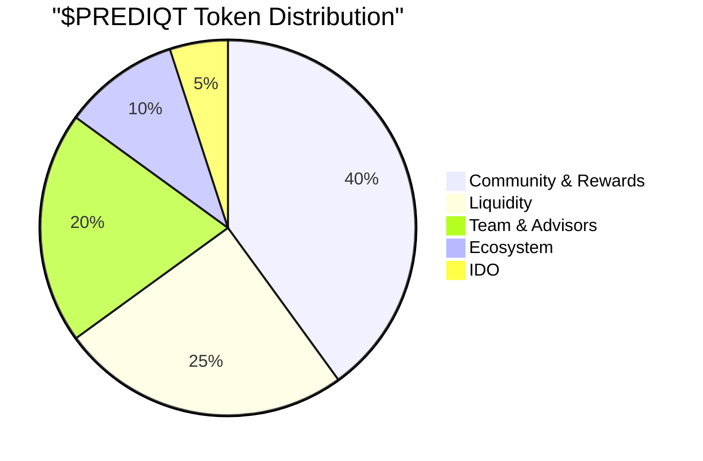

## The $PREDIQT Token

**$PREDIQT** is the native utility and governance token of the Prediqt ecosystem, designed to create a self-reinforcing economic flywheel that benefits all participants.

<Callout type="info" emoji="💎">
  $PREDIQT isn't just another token—it's the economic engine that aligns incentives between users, liquidity providers, and the protocol itself.
</Callout>

## Token Utility

<CardGroup cols={2}>
  <Card title="Betting Currency" icon="dice" color="#299EFF">
    Use $PREDIQT to place bets with enhanced rewards and reduced fees
  </Card>
  <Card title="Staking Rewards" icon="coins" color="#299EFF">
    Stake $PREDIQT to earn platform revenue share and APY rewards
  </Card>
  <Card title="Governance Rights" icon="gavel" color="#299EFF">
    Vote on protocol upgrades, new markets, and treasury allocation
  </Card>
  <Card title="Fee Discounts" icon="percent" color="#299EFF">
    Enjoy reduced trading fees when using $PREDIQT for predictions
  </Card>
</CardGroup>

## Tokenomics

### Supply Distribution

<Tabs>
  <Tab title="Total Supply">
    **1,000,000,000 $PREDIQT**
    
    Fixed supply with no inflation or minting capability
  </Tab>
  <Tab title="Initial Distribution">
    - **40%** - Community & Rewards
    - **25%** - Liquidity & Market Making
    - **20%** - Team & Advisors (2-year vesting)
    - **10%** - Ecosystem Development
    - **5%** - Initial DEX Offering
  </Tab>
</Tabs>

### Token Allocation Breakdown

## The Flywheel Effect

<Steps>
  <Step title="Platform Usage" icon="1">
    Users place bets on Prediqtmarket, generating trading fees
  </Step>
  <Step title="Revenue Generation" icon="2">
    Developer fees (0.5%) accumulate in the protocol treasury
  </Step>
  <Step title="Token Buybacks" icon="3">
    Treasury automatically buys $PREDIQT from the market
  </Step>
  <Step title="Value Accrual" icon="4">
    Buybacks create constant buy pressure, increasing token value
  </Step>
  <Step title="Enhanced Incentives" icon="5">
    Higher token value attracts more users and liquidity
  </Step>
</Steps>

<Note>
  This creates a positive feedback loop where increased platform usage directly benefits token holders through automated buybacks.
</Note>

## Staking Mechanics

### Staking Tiers

| Tier | Required $PREDIQT | Benefits |
|------|-------------------|----------|
| **Bronze** | 1,000+ | 5% fee discount, 10% APY |
| **Silver** | 10,000+ | 10% fee discount, 15% APY, early market access |
| **Gold** | 50,000+ | 20% fee discount, 20% APY, governance rights |
| **Platinum** | 100,000+ | 30% fee discount, 25% APY, market creation rights |

### Staking Rewards

<AccordionGroup>
  <Accordion title="Base APY" icon="chart-line">
    Earn 10-25% APY based on your staking tier, paid in $PREDIQT tokens from protocol revenue
  </Accordion>
  <Accordion title="Revenue Share" icon="money-bill-wave">
    Receive a proportional share of platform trading fees based on your staked amount
  </Accordion>
  <Accordion title="Bonus Multipliers" icon="fire">
    Long-term stakers earn multipliers up to 2x on their base rewards
  </Accordion>
</AccordionGroup>

## $SOL vs $PREDIQT Betting

<ComparisonTable>
  <ComparisonHeader>
    <ComparisonTitle>$SOL Betting</ComparisonTitle>
    <ComparisonTitle>$PREDIQT Betting</ComparisonTitle>
  </ComparisonHeader>
  <ComparisonRow>
    <ComparisonCell>Standard 2% trading fee</ComparisonCell>
    <ComparisonCell>Reduced fees (up to 30% discount)</ComparisonCell>
  </ComparisonRow>
  <ComparisonRow>
    <ComparisonCell>No additional rewards</ComparisonCell>
    <ComparisonCell>Bonus reward multipliers</ComparisonCell>
  </ComparisonRow>
  <ComparisonRow>
    <ComparisonCell>No governance rights</ComparisonCell>
    <ComparisonCell>Voting power in protocol decisions</ComparisonCell>
  </ComparisonRow>
  <ComparisonRow>
    <ComparisonCell>Standard market access</ComparisonCell>
    <ComparisonCell>Early access to new markets</ComparisonCell>
  </ComparisonRow>
</ComparisonTable>

## Future Utility Expansions

<CardGroup cols={2}>
  <Card title="Market Creation" icon="plus-circle">
    Stake $PREDIQT to create custom prediction markets
  </Card>
  <Card title="Oracle Staking" icon="link">
    Become an oracle validator by staking tokens
  </Card>
  <Card title="Liquidity Mining" icon="water">
    Earn bonus rewards for providing market liquidity
  </Card>
  <Card title="Cross-Chain Bridge" icon="bridge">
    Use $PREDIQT across multiple blockchains
  </Card>
</CardGroup>

## Contract Details

<Callout type="warning" emoji="⚠️">
  Always verify the official contract address from our website or documentation. Beware of scams and fake tokens.
</Callout>

### Official Contract
- **Network:** Solana Mainnet
- **Contract:** `[TO BE ANNOUNCED]`
- **Decimals:** 9
- **Symbol:** PREDIQT

## Get $PREDIQT

<Steps>
  <Step title="Connect Wallet">
    Use Phantom, Solflare, or any Solana-compatible wallet
  </Step>
  <Step title="Visit DEX">
    Trade on Raydium, Orca, or Jupiter aggregator
  </Step>
  <Step title="Swap for $PREDIQT">
    Exchange SOL or USDC for $PREDIQT tokens
  </Step>
  <Step title="Start Using">
    Stake, bet, or provide liquidity to earn rewards
  </Step>
</Steps>

<CardGroup cols={2}>
  <Card
    title="Start Staking"
    icon="lock"
    href="/using/staking-guide"
  >
    Lock your tokens for rewards
  </Card>
  <Card
    title="Trade on DEX"
    icon="arrow-right-arrow-left"
    href="https://raydium.io"
  >
    Get $PREDIQT tokens now
  </Card>
</CardGroup> 