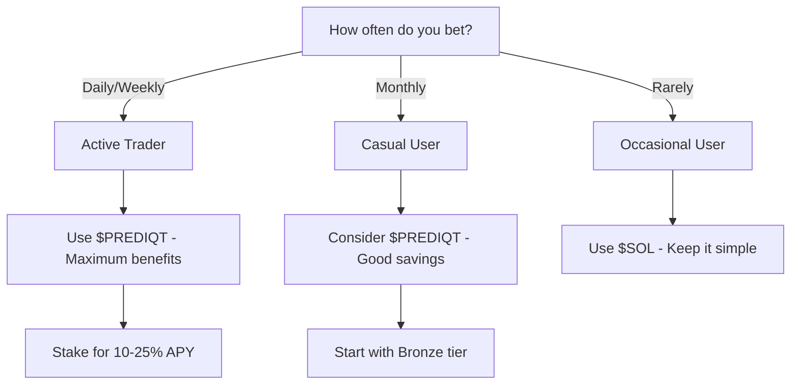

## Choosing Your Betting Currency

Prediqtmarket supports both **$SOL** and **$PREDIQT** for placing bets. While both work seamlessly, using $PREDIQT unlocks significant advantages.

<Callout type="info" emoji="💡">
  You can switch between currencies anytime. Your choice affects fees, rewards, and platform benefits.
</Callout>

## Quick Comparison

<Table>
  <TableHeader>
    <TableRow>
      <TableHead>Feature</TableHead>
      <TableHead>$SOL</TableHead>
      <TableHead>$PREDIQT</TableHead>
    </TableRow>
  </TableHeader>
  <TableBody>
    <TableRow>
      <TableCell>**Trading Fee**</TableCell>
      <TableCell>2%</TableCell>
      <TableCell>1.4% - 1.98% (based on tier)</TableCell>
    </TableRow>
    <TableRow>
      <TableCell>**Staking Rewards**</TableCell>
      <TableCell>❌ None</TableCell>
      <TableCell>✅ 10-25% APY</TableCell>
    </TableRow>
    <TableRow>
      <TableCell>**Bonus Multipliers**</TableCell>
      <TableCell>❌ None</TableCell>
      <TableCell>✅ Up to 2x on winnings</TableCell>
    </TableRow>
    <TableRow>
      <TableCell>**Early Access**</TableCell>
      <TableCell>❌ Standard</TableCell>
      <TableCell>✅ Priority for new markets</TableCell>
    </TableRow>
    <TableRow>
      <TableCell>**Governance**</TableCell>
      <TableCell>❌ No voting rights</TableCell>
      <TableCell>✅ Full voting power</TableCell>
    </TableRow>
    <TableRow>
      <TableCell>**Liquidity Mining**</TableCell>
      <TableCell>❌ Not eligible</TableCell>
      <TableCell>✅ Earn extra rewards</TableCell>
    </TableRow>
  </TableBody>
</Table>

## Detailed Benefits Breakdown

### Using $SOL

<CardGroup cols={2}>
  <Card title="Simplicity" icon="square-check" color="#299EFF">
    No need to swap tokens - bet directly with SOL from your wallet
  </Card>
  <Card title="Stability" icon="shield" color="#299EFF">
    Avoid $PREDIQT price volatility by using established SOL
  </Card>
  <Card title="Liquidity" icon="water" color="#299EFF">
    Easy to acquire and widely accepted across Solana ecosystem
  </Card>
  <Card title="No Lock-up" icon="unlock" color="#299EFF">
    No staking requirements - full flexibility with your funds
  </Card>
</CardGroup>

### Using $PREDIQT

<CardGroup cols={2}>
  <Card title="Fee Savings" icon="piggy-bank" color="#299EFF">
    Save up to 30% on every trade with tiered discounts
  </Card>
  <Card title="Passive Income" icon="chart-line-up" color="#299EFF">
    Earn 10-25% APY just for holding and staking
  </Card>
  <Card title="Reward Boosts" icon="rocket" color="#299EFF">
    Multiply your winnings with tier-based bonuses
  </Card>
  <Card title="Platform Perks" icon="crown" color="#299EFF">
    Exclusive features like early access and market creation
  </Card>
</CardGroup>

## Fee Structure Comparison

<Tabs>
  <Tab title="Small Trader (<$1,000)">
    **Example: $100 bet**
    
    With $SOL:
    - Fee: $2.00 (2%)
    - Net bet: $98.00
    
    With $PREDIQT (Bronze):
    - Fee: $1.90 (1.9%)
    - Net bet: $98.10
    - **Savings: $0.10 (5%)**
  </Tab>
  <Tab title="Active Trader ($1,000-$10,000)">
    **Example: $1,000 bet**
    
    With $SOL:
    - Fee: $20.00 (2%)
    - Net bet: $980.00
    
    With $PREDIQT (Silver):
    - Fee: $18.00 (1.8%)
    - Net bet: $982.00
    - **Savings: $2.00 (10%)**
    - Plus: 15% staking APY
  </Tab>
  <Tab title="High Volume (>$10,000)">
    **Example: $10,000 bet**
    
    With $SOL:
    - Fee: $200.00 (2%)
    - Net bet: $9,800.00
    
    With $PREDIQT (Platinum):
    - Fee: $140.00 (1.4%)
    - Net bet: $9,860.00
    - **Savings: $60.00 (30%)**
    - Plus: 25% staking APY + 2x multipliers
  </Tab>
</Tabs>

## ROI Calculator

Let's compare returns on a winning $1,000 bet (YES at $0.50, market resolves YES):

<CodeGroup>
```text $SOL Betting
Initial bet: $1,000
Trading fee: $20 (2%)
Shares purchased: 1,960 shares
Payout: $1,960
Net profit: $940 (94% ROI)
```

```text $PREDIQT Betting (Gold Tier)
Initial bet: $1,000
Trading fee: $16 (1.6%)
Shares purchased: 1,968 shares
Base payout: $1,968
Bonus multiplier: 1.5x = $492
Total payout: $2,460
Net profit: $1,444 (144.4% ROI)

Additional benefits:
- Staking rewards: ~$200/year
- Governance rights
- Early market access
```
</CodeGroup>

## When to Use Each Currency

### Use $SOL When:

<AccordionGroup>
  <Accordion title="You're New to Prediqt" icon="seedling">
    Start with SOL to understand the platform before investing in $PREDIQT
  </Accordion>
  <Accordion title="Making Small, Infrequent Bets" icon="coins">
    Fee savings may not justify holding $PREDIQT for occasional small bets
  </Accordion>
  <Accordion title="You Need Maximum Liquidity" icon="water">
    Keep funds in SOL if you need flexibility for other DeFi activities
  </Accordion>
</AccordionGroup>

### Use $PREDIQT When:

<AccordionGroup>
  <Accordion title="You're an Active Trader" icon="chart-mixed">
    Regular betting means fee savings compound quickly
  </Accordion>
  <Accordion title="You Want Passive Income" icon="money-bill-trend-up">
    Staking rewards provide returns even when not actively betting
  </Accordion>
  <Accordion title="You Believe in the Platform" icon="rocket">
    Token appreciation potential plus utility benefits
  </Accordion>
  <Accordion title="You Want Governance Rights" icon="gavel">
    Influence platform development and new market listings
  </Accordion>
</AccordionGroup>

## Migration Strategy

<Steps>
  <Step title="Start with SOL">
    Begin betting with SOL to familiarize yourself with the platform
  </Step>
  <Step title="Track Your Volume">
    Monitor your monthly betting volume and fee expenses
  </Step>
  <Step title="Calculate Break-Even">
    Determine if $PREDIQT holdings would save you money
  </Step>
  <Step title="Gradual Transition">
    Start with Bronze tier and upgrade as your activity increases
  </Step>
  <Step title="Maximize Benefits">
    Stake your $PREDIQT and participate in governance
  </Step>
</Steps>

## The Flywheel Effect

<Note>
  Using $PREDIQT creates a positive feedback loop:
  1. Your trades generate fees
  2. Fees fund buybacks
  3. Buybacks increase $PREDIQT value
  4. Your staked tokens appreciate
  5. Higher value attracts more users
</Note>

## Quick Decision Guide



## Conclusion

<Callout type="success" emoji="✨">
  While both currencies work on Prediqtmarket, $PREDIQT users enjoy significant advantages that compound over time. Active traders can save thousands in fees while earning passive income and platform perks.
</Callout>

## Next Steps

<CardGroup cols={3}>
  <Card
    title="Get $PREDIQT"
    icon="coin"
    href="/token/about-prediqt"
  >
    Learn how to acquire tokens
  </Card>
  <Card
    title="Start Trading"
    icon="play"
    href="/using/how-to-place-bet"
  >
    Place your first bet
  </Card>
  <Card
    title="Calculate Savings"
    icon="calculator"
    href="https://prediqt.market/calculator"
  >
    Estimate your fee savings
  </Card>
</CardGroup> 